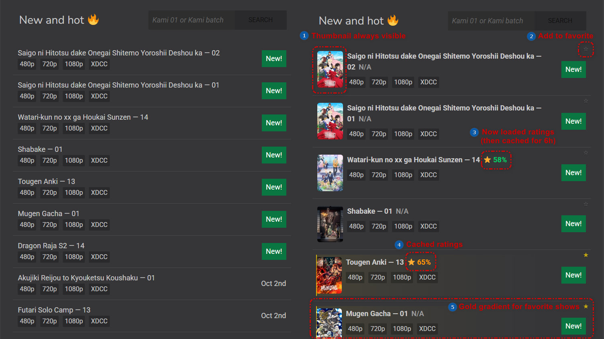
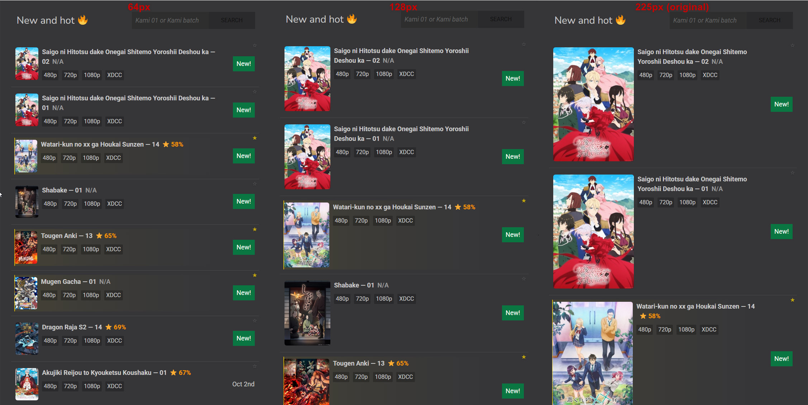
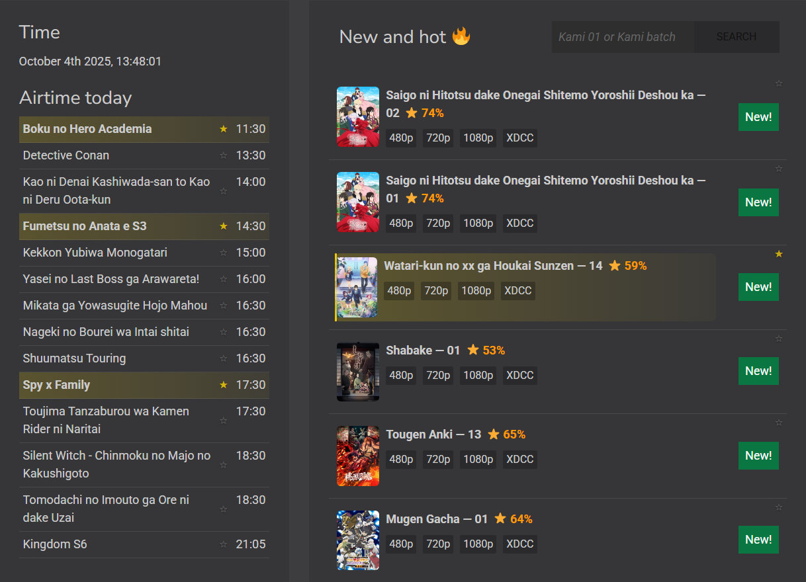
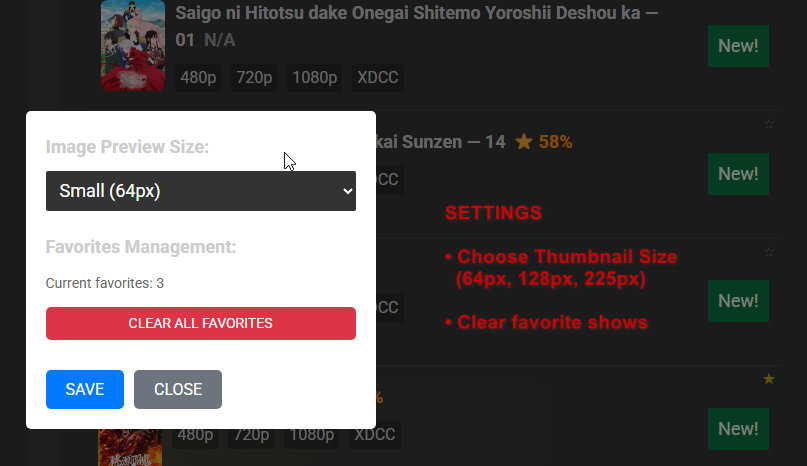

# SubsPlease ImgPreview

A TamperMonkey script that adds image preview functionality to the [SubsPlease](https://subsplease.org/) anime streaming site.

## Features
- Image previews for anime releases
- AniList ratings displayed alongside releases
- Click to refresh ratings
- User-configurable image sizes
- Settings dialog for easy customization
- Gradient overlay for better text visibility of favorite shows

## Installation
1. Install [TamperMonkey](https://www.tampermonkey.net/) extension for your browser.
2. Go to https://greasyfork.org/cs/scripts/551548-subsplease-fine-enhancer and click "Install this script".
3. Enjoy enhanced browsing on SubsPlease!

## Screenshots

### **Main Page (Add thumbnails, Ratings (+ cached), Favorites)**

### **Thumbnail Sizes (User-configurable: 64px, 128px, 225px)**

### **Airtime Favorites**

### **Settings Dialog (Change thumbnail sizes, Clean favorites)**

