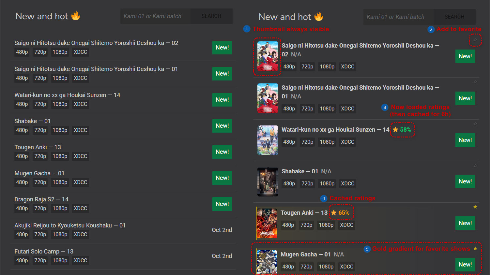
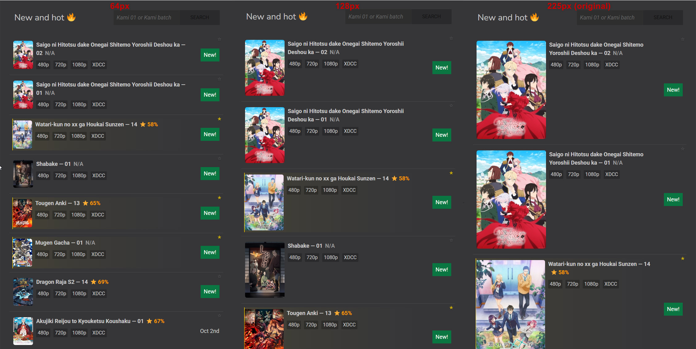
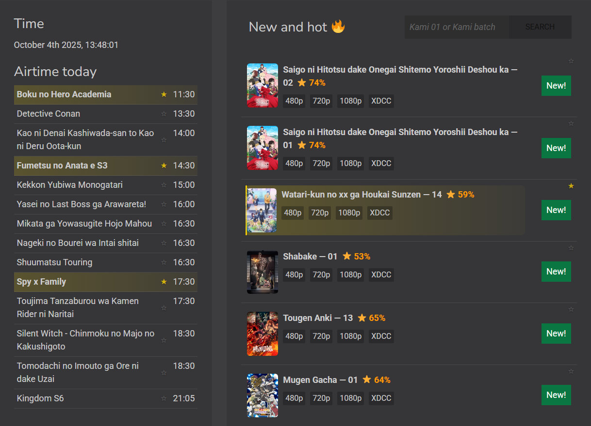
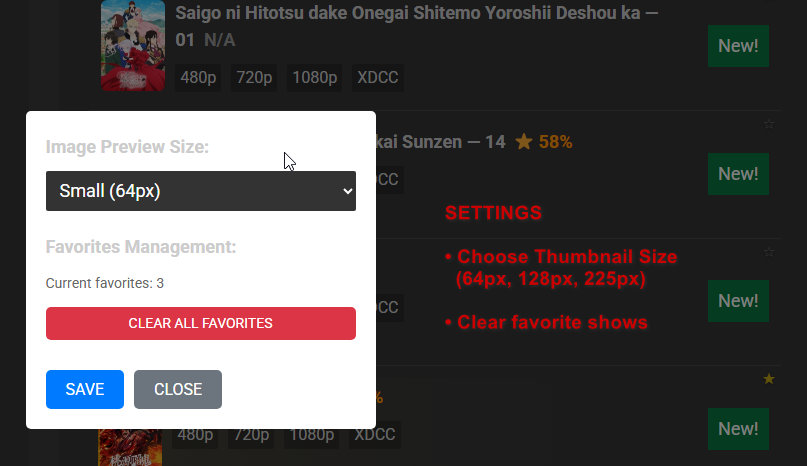

# SubsPlease Fine Enhancer

A TamperMonkey script that adds image preview functionality to the [SubsPlease](https://subsplease.org/) anime streaming site.

## Features
- Image previews for anime releases
- AniList ratings displayed alongside releases (batched requests — fast even for the whole `/shows/` list)
- Click to refresh ratings
- Favorites with visual highlights on the main page, schedule widget, and `/shows/` listing
- **Cross-device sync** of favorites + settings via a private GitHub Gist (star a show at work, see it at home)
- Search box and "★ Favorites only" filter on the `/shows/` page
- Configurable rating color thresholds; right-click a rating to set a custom AniList search title (for mismatched romanizations)
- User-configurable image sizes
- Dark-theme-aware settings dialog with export/import of favorites
- Gradient overlay for better text visibility of favorite shows

## Installation
1. Install [TamperMonkey](https://www.tampermonkey.net/) extension for your browser.
2. Go to https://greasyfork.org/cs/scripts/551548-subsplease-fine-enhancer and click "Install this script".
3. Enjoy enhanced browsing on SubsPlease!

## Cross-device sync (GitHub Gist)

Favorites and settings can sync between browsers/machines through a **private Gist** in your own GitHub account. Setup (once per device):

1. Create a GitHub personal access token with **only the `gist` scope**:
   GitHub → Settings → Developer settings → Personal access tokens → Generate new token (classic) → check `gist` only.
2. On subsplease.org, open the Tampermonkey menu → **Settings**, paste the token into the *Sync* field, and click **Sync now** (or Save).
3. Repeat on your other device with the same token. The script finds (or creates) the gist `subsplease-fineenhancer-sync.json` automatically.

How it works:
- Syncs automatically on page load and a couple of seconds after you star/unstar a show; you can also trigger it via the **Sync now** menu command.
- Conflicts merge **by timestamp** — the newest add/remove per show wins, so starring at work and at home on the same day keeps both.
- Removals are stored as tombstones (kept 90 days), so a deleted favorite won't come back from an older device.
- **Disconnect** in Settings removes the token from that browser; the gist itself stays in your GitHub account.

## Screenshots

### **Main Page (Add thumbnails, Ratings (+ cached), Favorites)**



### **Thumbnail Sizes (User-configurable: 64px, 128px, 225px)**



### **Airtime Favorites**



### **Settings Dialog (Change thumbnail sizes, Clean favorites)**



## DEVELOPMENT

The idea: instead of copy-pasting the script into Tampermonkey after every change, you create a small **dev wrapper script** in Tampermonkey whose only job is to `@require` the real file from your local repo. Edit the repo file, refresh the page, done.

> ⚠️ **The #1 gotcha:** Tampermonkey takes `@grant` and `@connect` permissions from the **wrapper's header**, NOT from the `@require`d file. If the wrapper header is missing a grant (e.g. `GM_deleteValue`) or a `@connect` domain (e.g. `api.github.com`), the script throws `GM_xxx is not defined` or `Refused to connect to … not a part of the @connect list` — even though the required file declares them. **Whenever the header of `src/subsplease-fine-enhancer.user.js` changes, copy the `@grant` / `@connect` lines into your dev wrapper too.**

### Chrome / Opera / Edge (file:// require)

1. Enable local file access for Tampermonkey: `chrome://extensions` → Tampermonkey → Details → **Allow access to file URLs**.
2. Create a new script in Tampermonkey with only this header (adjust the path; on Windows use `file:///C:/path/to/repo/...`):

```js
// ==UserScript==
// @name         [DEV] SubsPlease Fine Enhancer
// @match        https://subsplease.org/*
// @require      file:///home/YOU/projects/SubsPlease-FineEnhancer/src/subsplease-fine-enhancer.user.js
// @grant        GM_xmlhttpRequest
// @grant        GM_addStyle
// @grant        GM_setValue
// @grant        GM_getValue
// @grant        GM_deleteValue
// @grant        GM_registerMenuCommand
// @connect      graphql.anilist.co
// @connect      api.github.com
// @connect      gist.githubusercontent.com
// @run-at       document-start
// ==/UserScript==
```

3. Disable the production (GreasyFork) version of the script while the DEV one is active, otherwise both run and everything gets processed twice.
4. Edit files in the repo, hit F5 on subsplease.org — changes apply immediately.

### Firefox (localhost require)

Firefox blocks `file://` requires, so serve the file over HTTP instead:

1. Run a local server in the `src` directory:
   - python: `python3 -m http.server 8080`
   - node: `npx http-server -p 8080`
2. Important: Tampermonkey Dashboard → Settings → Externals → **Update Interval: Always** — otherwise Tampermonkey caches the required file and your saves won't show up on refresh.
3. Create the same wrapper as above, but with:

```js
// @require      http://localhost:8080/subsplease-fine-enhancer.user.js
```

(keep all the `@grant` / `@connect` lines identical to the Chrome variant).

### Testing the Gist sync in dev

- Use a GitHub token with **only the `gist` scope**; paste it via Tampermonkey menu → Settings → Sync.
- The sync gist is found by filename (`subsplease-fineenhancer-sync.json`), so a dev browser and your production browsers share the same gist — convenient, but remember your dev experiments touch your real favorites. To sandbox, use a token from a second GitHub account.
- Watch the browser console: sync failures are logged there (`Sync failed: …`), and the settings dialog shows live status. A "Network error reaching GitHub" almost always means the wrapper header is missing `@connect api.github.com` (see the gotcha above).
- After changing the token, the stored gist id is re-resolved automatically; **Disconnect** in Settings clears both token and gist id from that browser.
